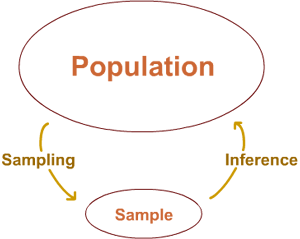
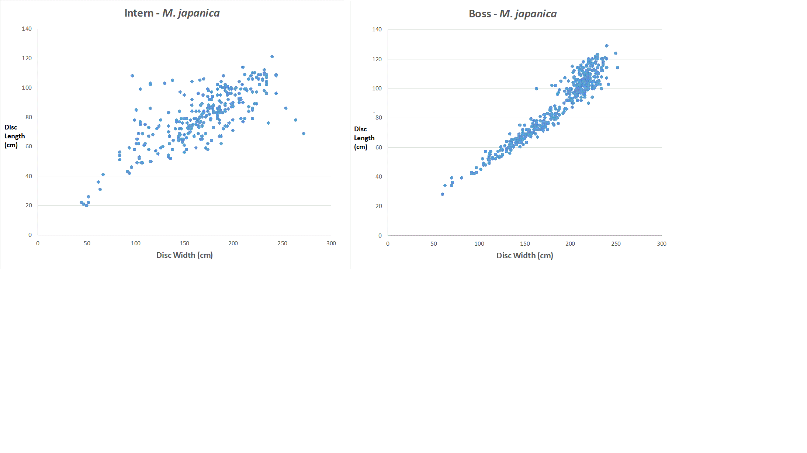
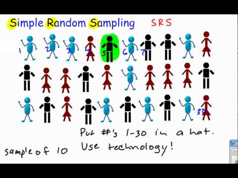
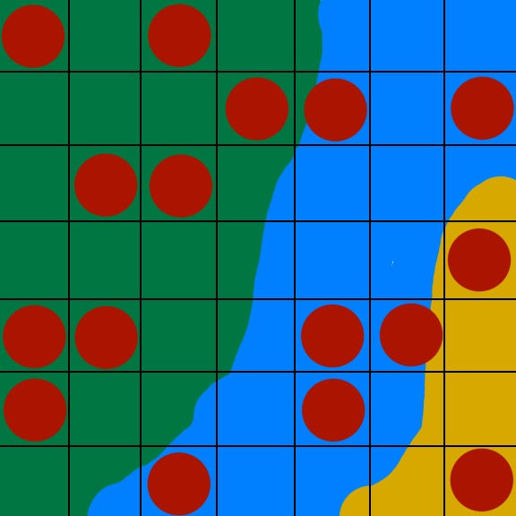
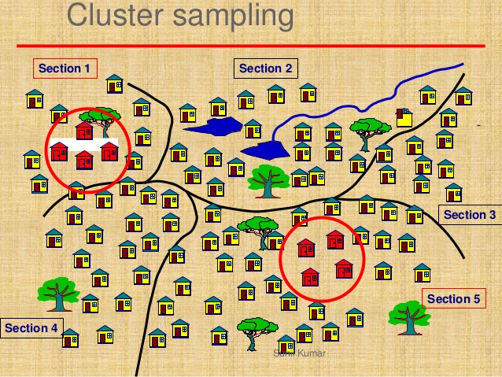
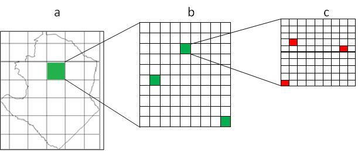

```{r setup, include=FALSE}
knitr::opts_chunk$set(echo = TRUE)
```
## Planning Experiments
Today we will be talking about things you should do before you start your experiment or observational study. Remember, we are trying to make observations in order to say something about the real world, and to do this we are extrapolating from our samples to say something about a much larger population.



How you collect your sample will have huge impacts on the type of statistical models you are able to run on your data and the quality of the estimates you get from them. In other words, how you collect your samples will determine the quality of what you are able to do with it.

## Utility of Pilot Studies

## Various Sources of Error
Talk about error. What do you think some sources are?



In general when we talk about error there are two main sources:

- sampling error
- process error

There is also user error, but we usually don't discuss this in statistics. User error would be when you record a number wrong in your data, so instead of 101cm, you write 100cm. This can also be is you mislable the units. Residual analysis can sometimes be used to find the data points that are user error, but not always. For instance, if I recorded 101 instead of 100, and then gave that data to Josh, he would have no way of knowing there was an error. If I recorded 1000 instead of 100 he may have a chance to determine it is an error.

### Sampling Error
Sampling error refers to error introduced by the measuring scheme.

Imagine we are measuring the widths of wing-span of a manta ray. If we are measuring with a tape measurer that is only marked in centimeters (cm), all of our measurements will have to be to the nearest cm. We have introduced a form of error into the data by only recorded length to the nearest cm.

### Process Error
Process error refers to the natural variability. 

If we think of the possible wing-span of a manta ray that is 1 year old, not all 1 year old mantas are exactly the same length. Instead we seen a range of values. This variability in lengths of 1 year old mantas is the natural variability or process error.


## Importance of Other Covariates

## Importance of Zeros

## Importance of Collecting Effort Data

### Calculating CPUE

## Sampling Design
Sampling design is the procedure by which the sample is selected. There are two very broad categories of sampling designs.

#### Probability Sampling.
When we use probability sampling , randomness will be built into the sampling designs so that properties of the estimators can be assessed probabilistically, e.g., simple random sampling, stratified sampling, cluster sampling, systematic sampling, network sampling, etc.

#### Quota Sampling
This is what people used to do before 1948. Sampling here is based upon quotas. For instance, each interviewer will sample based upon quotas that are representative of the population where the selection of respondent is left up to the subjective judgment of the interviewers. The bad thing is the selection of the respondent is in the hands of the interviewers. How can you ensure that the sample of the students that you have selected is indeed representative? If you are subjective when it comes to the individuals sampled, then this is an example of quota sampling.

*This is often what happens in ecology, especially in satellite tagging studies with rare or hard to find animals.*

### Simple Random Sampling
You can think of simple random sampling as closing your eyes and pointing your finger onto the map a bunch of times. There are computer models that will choose random points for you within a specific area (your sampling area).  

If your sampling area is a perfect rectangle, you can use the bounds of that rectangle and have R choose the random latitute and longitude pairs from within that rectangle that you need to use. 

The overall mean and standard deviation for the a sample from simple random sampling is the basic one.

$$\bar{x} = \sum{ \frac{x_{i}}{n}}$$
$$S^{2}=\frac{\sum{(x_{i}-\bar{x})^{2}}}{n-1}$$


### Stratified Random Sampling
When we are concerned that the variable (or variables) we are interested in may change as a result of some factor, we may want to take special care to sample within that factor.

A simple example is looking for Manta Rays. We are more likely to find Mantas in water that is deeper, they don't hang out in water very shallow, so we will want to spend more of our sampling effort in deeper water. We may take a map of the bay and divide it into two strata, deep and shallow. We can then place more of our effort in the deep strata. 



We can now calculated the mean by weighting the mean from each strata $j$.

$$\bar{x}=\sum \sum \frac{x_{ij}}{n_{j}} = \sum \frac{\bar{x_{j}}}{n_{j}} $$

### Cluster Sampling



### Oportunistic Sampling

## Determining Sample Size


## Experimental Design

### Replication
Replicates -  Repetition of all or some experiments

### Psuedo replication
When you have non-independent replicates. 

Example of pseudo replication:
You are interested in the amount of carbon dioxide in manta blood. You measure the carbon dioxide level in one manta 25 times. You think you have 25 measurements of carbon dioxide. Instead you have 1 time series of 25 measurements of the same manta. This sample would not be very useful in knowing the average amount of carbon dioxide in manta blood.

### Nesting
When one of the factors in actually a variable inside another factor. 

Example of nesting:
We are interested in if a new teaching method for math works better than the old method. We apply the new method in a bunch of classrooms at 5 different schools. The classrooms will be nested within what school they are from.


Example of nesting:
The bay that is just outside. If we sample from 5 locations within the Bay and then compare it to 5 locations within San Diego Bay. There will be 5 locations nested within the Bay here and 5 locations inside of San Diego Bay. 

Nesting becomes important when you start to construct more advanced models, particularly generalized linear models (glm).


### Factorial Design
Factors: Variables that affect the response variable. 

E.g., Temperature, chl *a* level, location, substrate, nutrient levels, etc. 

Also called predictor variables or predictors. 

If we are doing a controlled experiment in ecology we can often control these factors. Then we can play with how we alter the factors.

Simple Designs: Vary one factor at a time

- Not statistically efficient. 
- Wrong conclusions if the factors have interaction. 
- Not recommended. 

Full Factorial Design: All combinations. 

- Can find the effect of all factors. 
- Too much time and money. 
- May try $2^{k}$ design first.

Fractional Factorial Designs: Less than Full Factorial 

- Save time and expense. 
- Less information. 
- May not get all interactions. 
- Not a problem if negligible interactions


#### Design Factorial Experiment-- Group Example
Imagine, you are interested in the growth of seastars and you have 4 variables you can choose to vary:

- temperature
- sunlight
- pH
- food

Get in groups and design your experiments. You are limited to a maximum of 50 experimental tanks. Start with the questions you are interested in. Say what you would do with the tanks and which of the factors (variables) you would alter. [10 min]

1. Which factors did your group select?
2. Which levels of each factor did you decide to do?
3. How many replicates of each did you want to do?

Levels- the values that a factor can assume (also called treatments)

Replicates -  Repetition of all or some experiments

### Multiple Tests


